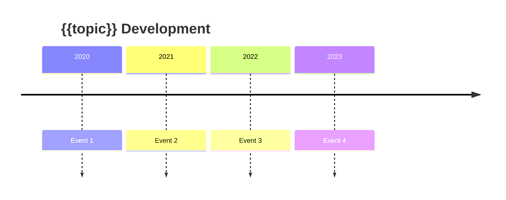

# {{topic}} - Map of Content

## Overview
*High-level summary of this topic and why it matters*

## Core Concepts
### Fundamental Ideas
- [[concept1]]
- [[concept2]]

### Advanced Topics
- [[concept3]]
- [[concept4]]

## Research Papers
### Foundational
- [[paper1]] ({{year}}) - Key contribution
- [[paper2]] ({{year}}) - Key contribution

### Recent Advances
- [[paper3]] ({{year}}) - Key contribution
- [[paper4]] ({{year}}) - Key contribution

### My Reading Queue
- [ ] [[paper5]]
- [ ] [[paper6]]

## Models & Implementations
### Production-Ready
- [[model1]] - Use case
- [[model2]] - Use case

### Experimental
- [[model3]] - Exploring for

## Code Resources
### Reference Implementations
- [[repo1]] - What it does well
- [[space1]] - Demo of

### My Implementations
- [[my-project1]]

## Datasets
- [[dataset1]] - For training
- [[dataset2]] - For evaluation

## Evolution Timeline

## Key Patterns
1. **Pattern 1**: Description
2. **Pattern 2**: Description

## Open Problems
1. 
2. 

## Related Topics
- [[related-moc-1]]
- [[related-moc-2]]

## Resources
- Survey Papers: 
- Tutorials: 
- Communities: 

---
*Last updated: {{date}}*